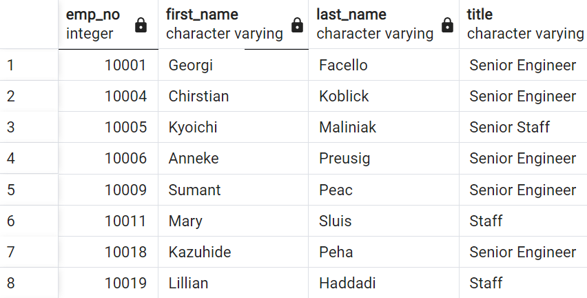
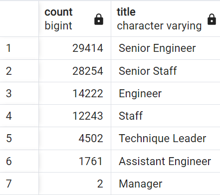
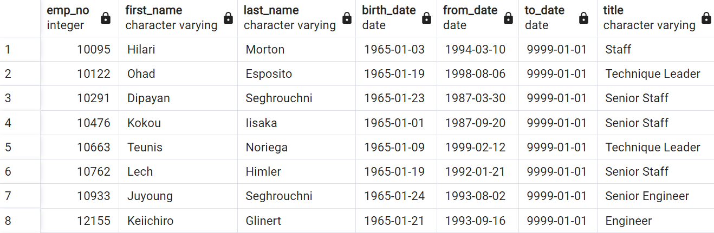

# Pewlett_Hackard_Analysis

## Overview

The number of retiring employees in their respective titles needs to be determined while also identifying eligible employees for the mentorship program.

## Results

### Individual Retiring Employees by Title

Note that by designing an ERD, I was able to reference it to create a Retirement Titles table encompassing the most recent titles of those who were born between January 1, 1952 and December 31, 1955.

#### Explaination of Unique Titles table (below):

- Shows all employees born between January 1, 1952 and December 31, 1955
- Table is arranged by employee number, employee first/ last name, and employee title
- Employees no longer working for the company were dropped

### Total of Retiring Employees and their Title

#### Explaination of Retiring Table

- Total count of retiring employees with title
- Count is in descending order

### Mentorship Eligibilty Table

#### Explaination of Mentorship Table

- Glimpse at eligible employees able to partcipate in the mentorship program

## Summary

- Managerial postions have been the focus of replacement instead of other positions
- Over 90,000 positions will need to be filled
- There are not enough mentors for the mentorship program
